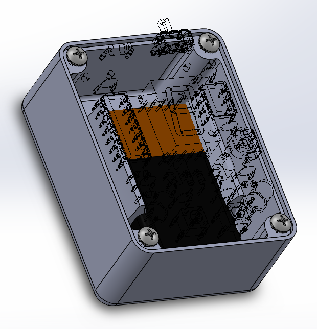

# CD4026_Reaction_Time_Game
A CD4026 / NE555 based Reaction Time Game with Latching Input Switches

Designed by Mike Kushnerik (MKE) in KiCad V5

# Enclosure

To make things look nicer, I designed a simple 3D printable enclosure to mount the PCB and a 9V battery. 

See the Enclosure folder for design files and STL!

# License

MKE supports the open source hardware community by sharing hardware design files freely on GitHub!

Please support MKE by purchasing products on [Tindie](https://www.tindie.com/stores/mkengineering/)!

Designed by Mike Kushnerik for MKEngineering

Licensed under [Creative Commons Attribution-ShareAlike CC BY-SA 3.0](http://creativecommons.org/licenses/by-sa/3.0/)

All text above must be included in any redistribution!
